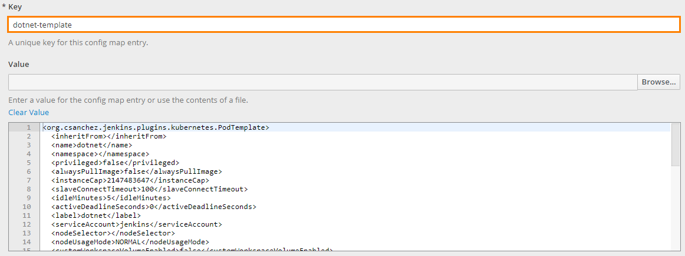
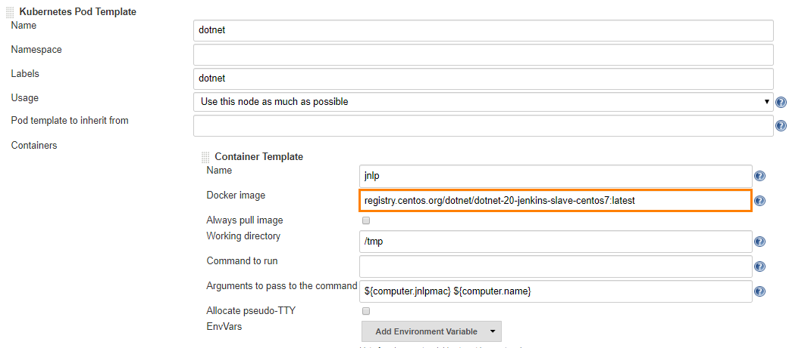

# Docker Image for Jenkins Dotnet Agent

This page contains essential information on how to rebuild the existing image and add it into the Jenkins agent configuration.

## Build an Image

In order to build an image from the source, perform the following:

1. Make appropriate changes in Dockerfile (e.g. update build tool / package versions);
2. Build a Docker image from the current project directory using the command below:
   ```bash
    docker build . -t edp-jenkins-dotnet-agent:latest
   ```
3.  Push the newly created Docker image to your public or private Docker image hub:
   ```bash
    docker push examplehub/edp-jenkins-dotnet-agent:latest
   ```

## Add an Image

In order to add an image into the Jenkins agent configuration, follow the steps below:

1. Open the existing or add a new template for Jenkins slave by navigating to the ***jenkins-slaves*** config map under the EDP namespace;
2. Fill in the _Key_ field and add a value:
   
3. Specify the image and tag in ***jenkins-slaves*** config map:
    ```xml
    <containers>
      <org.csanchez.jenkins.plugins.kubernetes.ContainerTemplate>
        <image>examplehub/edp-jenkins-dotnet-agent:latest</image>
      </org.csanchez.jenkins.plugins.kubernetes.ContainerTemplate>
    <containers>
    ```
   _**INFO**: Alternatively, there is the ability to change the image in Jenkins K8S Pod Template settings. 
   To do this, navigate to the ***Container Template*** and replace your image in the ***Docker image*** field:_ 
   
   
   
4. As a result, the Jenkins agent will be launched with a newly rebuilt image.